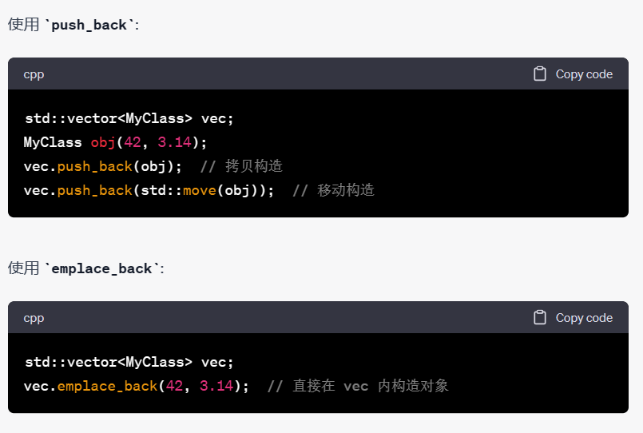
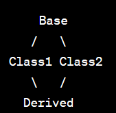
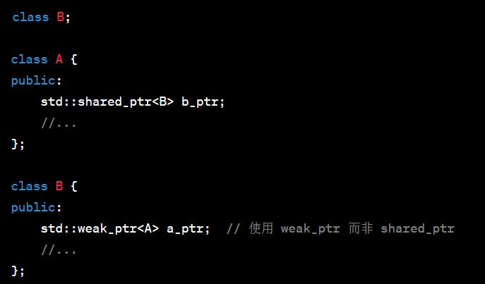
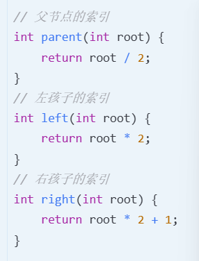

# 字节面试

### 1、leetcode接雨水（42）

- 暴力解法：依次遍历每个格子的接水量，计算当前格子的左右最大高度减去自身高度得到接水量

```c++
class Solution {
public:
    int trap(vector<int>& height) 
    {
        int result = 0;
        int length = height.size();
    
        for(int i=0;i<length-1;i++)
        {
             int lMax = 0;
             int rMax = 0;
             for(int j = i;j<length;j++)
             {
                 rMax = max(rMax,height[j]);
             }
             for(int j=i;j>=0;j--)
             {
                 lMax = max(lMax,height[j]);
             }
             result += min(lMax,rMax)-height[i];
         }
        return result;
        
    }
};
```

- 备忘录解法：将当前格子的左右最大高度存储下来（避免重复计算）

```c++
class Solution {
public:
    int trap(vector<int>& height) 
    {
        int result = 0;
        int length = height.size();
        vector<int> lMax(length);
        vector<int> rMax(length);
        lMax[0] = height[0];
        rMax[length-1] = height[length-1];
        for(int i=1;i<length;i++)
        {
            lMax[i] = max(lMax[i-1],height[i]);
        }
        for(int i=length-2;i>=0;i--)
        {
            rMax[i] = max(rMax[i+1],height[i]);
        }
        for(int i = 0;i<length;i++)
        {
            result += min(lMax[i],rMax[i])-height[i];
        }
       
        return result;
        
    }
};
```

- 双指针解法：

```c++
class Solution {
public:
    int trap(vector<int>& height) 
    {
        int left = 0;
        int right = height.size()-1;
        int result = 0;
        int lMax=0,rMax=0;
        while(left<right)
        {
            lMax = max(lMax,height[left]);
            rMax = max(rMax,height[right]);
            if(lMax<rMax)
            {
                result+=lMax-height[left];
                left++;
            }else{
                result+=rMax-height[right];
                right--;
            }

        }
        return result;
    }
};
```

### 2、内存对齐

- 对齐规则按照成员的声明顺序，依次安排内存，其**偏移量是成员大小的整数倍**，最后结构体的大小为最大成员的整数倍
- C++空的结构体和类所占内存为1字节，C中的空的结构体所占大小为0
- 数据结构应该尽可能在自然边界上对齐，访问未对齐的内存需要做两次访问，对齐的内存只需要一次
- C++动态内存对齐分配：aligned_alloc(free释放)

### 3、页式存储和段式存储

- paging：物理内存和虚拟内存都被划分为固定大小的块，称为页面，虚拟页面被映射到物理页面上（特点：固定大小4KB或8KB；系统未每个进程维护一个页表，用于存储虚拟页面到物理页面的映射；可以简化内存管理）
- segmentation：内存被分为不同的段，段的大小由包含信息决定（特点：与程序的逻辑结构相关；系统为没一个进程维护一个段表，其中包含每个段的基址和限制）

### 4、最长回文字符串

- 回文串的长度可能是奇数或偶数，需要从从中心向两端扩散的双指针

### 5、动态规划（dynamic programming,dp）

- 

### 6、进程内存分区

- 文本段：存放进程的机器代码
- 数据段：存放进程的全局变量和静态变量（未初始化数据段：通常不在磁盘上为每个未初始化的变量分配空间，在加载时为他们分配零填充的内存）
- 堆：用于动态内存分配（从低地址开始增长到高地址）
- 栈：存储局部变量、函数调用的返回地址（从高地址开始向低地址增长）
- 命令行参数和环境变量：从命令行传递给程序的参数以及设置的环境变量

### 7、线程独占资源和同步机制（多线程）

- 用于保护共享数据以及协调线程的执行
- 线程独占资源为了防止多个线程同时访问和修改同一资源，导致数据不一致；实现方式为互斥量（mutex），确保任何时候只有一个线程可以访问某块代码和数据
- 线程同步机制用于确保线程**按照预期的顺序和条件执行**；实现方式时条件变量，常与互斥量一起使用，允许一个或多个线程等待某个条件满足
- 同步操作中调用者和被调用者在时间上是串行的，即一个完成后另一个才可以开始；异步操作中调用者和被调用者在时间上是并行的，即可以同时进行不依赖彼此

### 8、乐观锁和悲观锁

- 悲观锁：总是假设最坏的情况，每次读取数据都认为其他线程会修改数据，因此在整个数据处理中都会加锁；可以确保数据的一致性，可能导致资源争用和锁的开销
- 乐观锁：假设冲突是罕见的，不会明确锁定资源，在提交更改之前检查是否存在冲突，如果检测到冲突，操作被终止；实现方式使用版本号或者时间戳

### 9、auto实现原理

- 涉及到模板或者迭代器
- 基于编译器的类型推导机制，会查看该变量的初始化表达式，然后推导出相应的类型（编译时确定）
- 主要依赖于**模板参数推导的同一集合规则**，但是没有模板实际参与其中，编译器实际上在背后执行了与模板类型推导类似的操作
- 同一性规则：如果从不同的源推导出的类型完全一致那么他们是一致的；顶层const和&被忽略；如果得到了不同的类型那么推导失败编译器会报错

### 10、写时拷贝技术

- 引用计数
- 减少在对象复制时不必要的数据复制开销，当对象被复制时，不立即进行实际数据的拷贝，而是让原对象和复制的对象共享同一份数据，只有当其中一个对象**修改数据**时，才会执行真正的数据拷贝操作
- 每次数据被修改时检查引用计数，如果大于1则进行实际的数据拷贝并减1；否则直接修改数据

### 11、push_back和emplace_back区别

- push_back：将一个已经存在的对象放入容器中，需要调用该对象的拷贝构造或者移动构造
- emplace_back：在容器内直接构造对象，不需要创建一个临时对象再放入容器



### 12、为什么进程多并发而要用线程多并发

1. **资源开销**：
   - **进程**：每个进程都有自己的地址空间、内存、数据堆栈以及与其关联的许多内核资源。因此，创建进程、进程间切换和进程通信（IPC）通常都比线程更加开销大。
   - **线程**：线程是进程内的轻量级实体，共享相同的地址空间和资源。创建、销毁和切换线程通常都比进程更快、更高效。
2. **通信**：
   - **进程**：进程间的通信（如管道、套接字、共享内存等）通常比较复杂，涉及额外的编码和上下文切换。
   - **线程**：由于线程共享相同的内存地址空间，线程间的通信变得更为简单。线程可以直接读写共享变量（尽管这样做可能需要同步机制以避免竞态条件）。
3. **数据共享**：线程之间直接共享内存和变量，这在某些应用中可能是必需的或更为方便的。而进程之间则需要使用特定的IPC机制来共享数据。
4. **启动和停止速度**：由于较小的开销，线程的启动和停止通常比进程更快。
5. **灵活性**：在某些现代操作系统中，线程可以有不同的调度优先级或归属于不同的调度组，这为复杂的应用程序提供了额外的灵活性。
6. **现代硬件并发**：多核和多处理器系统变得越来越普遍。为了充分利用这些核心，许多应用程序选择使用多线程并发，因为线程可以被映射到不同的处理器或核心上并同时运行。

然而，线程并发也有其挑战，如需要正确地同步访问共享资源、可能的死锁情况、以及在某些情况下可能的性能问题（如过多的线程导致的上下文切换开销）。

总的来说，虽然进程提供了良好的隔离和安全性，但线程由于其轻量性、快速和高效的通信能力，在实现多并发时往往是首选。

### 13、死锁产生的条件

死锁是一个在并发系统中进程或线程互相等待共享资源的现象，导致所有涉及的进程或线程都无法向前执行。为了死锁的发生，通常需要满足以下四个条件，这四个条件也称为死锁的必要条件：

1. **互斥条件（Mutual Exclusion）**:
   - 资源不能被多个进程或线程同时占有。一个资源一次只能被一个进程或线程使用。
2. **占有并等待（Hold and Wait）**:
   - 一个进程或线程在保持至少一个资源的情况下，又请求额外的资源。并且，这些额外的资源被其他进程或线程所持有。
3. **非剥夺条件（No Preemption）**:
   - 资源一旦被进程或线程占用，就不能被其他进程或线程从其手中强制夺走，除非资源拥有者自愿释放资源。
4. **循环等待条件（Circular Wait）**:
   - 存在一个进程或线程的集合{P1, P2, ... , PN}，其中P1等待P2持有的资源，P2等待P3持有的资源，...，PN等待P1持有的资源。这形成了一个循环的等待链。

所有这些条件都必须同时满足才会产生死锁。为了预防死锁，可以通过破坏上述任何一个条件来避免死锁。例如，可以使用资源分配图和银行家算法来避免循环等待，或使用资源请求时的超时来避免占有并等待。

# 宝信软件面试

### 1、数据库写入失败的过程

当数据库（mysql）执行写入操作（insert update delete）并且该操作失败时，会执行以下过程

- 日志记录：在写入数据前，数据库会在其redo日志记录该操作，确保即使写入操作失败仍然可以根据日志进行回复
- 开始事务：会开始一个新的事务或者继续现有的事务
- 获取锁：根据使用的存储引擎（innoDB），尝试获取锁来进行写入操作，如果不能获取，操作可能会阻塞，直到锁被释放或达到超时
- 数据验证和约束检查：检查将写入的数据是否满足表的定义和约束，如果不满足操作立即失败
- 处理错误：当写入失败，mysql生成一个错误，如果是事务的一部分，当前事务被标记为已回滚
- 日志记录：回滚信息写入事务日志
- 释放锁：无论成功还是失败
- 返回错误消息

### 2、生产者消费者设计模式的具体应用中间件

- 并发设计，有助于解耦数据生产和消费的速度，确保系统组件可以独立地以不同地速度运行
- Redis：是一个开源的、基于内存的键值数据结构存储系统，可以用作数据库、缓存和消息代理
- Google Cloud：托管消息传递服务

### 3、软件设计原则

- SOLID原则：单一职责原则（一个类只有一个职责）、开放封闭原则（类或者函数应该对扩展开放，对修改封闭）、Liskov原则（子类型必须能够替换其基类型）、接口隔离原则（客户端不应该被迫依赖于他们不适用地接口）、依赖倒置原则（高级模块不应该依赖于低级模块，两者都依赖于抽象）
- 避免代码重复
- 一个对象应该对其他对象尽可能少的了解

### 4、设计模式分类

- 创建型：对象创建机制，涉及对象实例化并且直接使用构造函数（单例、工厂、建造者、原型）
- 结构型：涉及类和对象地组合，关注于如何构建对象和类地组合（适配器、桥接、组合、装饰、外观、代理）
- 行为型：关于对象间地职责分配，协调运行时对象间地合作关系（观察者、策略、访问者）

### 5、C++自带的文件监听库函数

boost::filesystem、libuv

### 6、如何平衡生产者和消费者之间地关系

- 使用缓冲区/队列：当队列满时，生产者可以暂停或减缓生产速度；当队列为空或低于某个阈值，消费者可以暂停或减缓处理速度
- 设置阈值
- 反馈机制
- 优先级设置：更高优先级地任务先被执行
- 使用信号量或互斥锁：同步
- 定期监控：添加线程监控类
- 限流

# 中科曙光面试

### 1、static全局变量和普通全局变量的区别

- 普通全局变量具有外部链接性，在其他源文件可以通过extern关键字来引用；static全局变量具有内部链接性，该变量只能在定义的源文件中访问，不可以在其他源文件可以通过extern关键字来引用
- 生存期都是整个程序的执行时间

### 2、数组与指针的区别

- 定义和内存分配：当定义数组会分配一段连续的内存空间；当定义指针时只是定义了一个指针变量，除非明确分配内存，否则不会指向任何有意义的地址
- 大小：数组与存放数据大小有关，指针与指向类型无关（32位：4字节，64位：8字节）
- 可变性：数组名代表首地址不能修改；指针是一个变量可以修改
- 操作：数组不能进行增加或减少的操作
- 元素访问不同：数组采用角标；指针采用解引用
- 内存分配方式：数组在栈上分配；指针可以指向栈上内存或动态内存分配在堆上
- 生存期：指针直到内存被释放

### 3、左值与右值是什么，区别有哪些

- 左值是一个对象的地址或者能够通过解引用指针获取到的一个内存位置。因为左值有其内存地址，所以它可以出现在**赋值语句**的左侧或右侧
- 右值指的是不能定位到存储位置的表达式，它**只提供数据值而不是存储位置**。右值通常是**临时的，它们不能被赋值**，因为没有具体的存储位置与之关联

### 4、内存有哪几种类型

- 主存储器：RAM比ROM快
- 辅助存储器（硬盘、光盘、磁带、USB）
- 缓存内存Cache：位于CPU和主存储器之间，提供高速数据访问
- 寄存器：CPU内部的最小最快存储单元（即时数据和中间值）
- 虚拟内存

### 5、堆和栈的区别

- 栈用于静态内存分配
- 堆用于动态内存分配（new delete）

### 6、程序编译的过程

- 预处理（#include #define#ifndef）：头文件、替换宏
- 词法分析：将源代码转为一个标记流或符号
- 语法分析：解析，将上一步的标记流转换为一个抽象的语法树，检查代码是否遵循语言的语法规则
- 语义分析：验证语法树是否遵循语言的语义规则
- 中间代码生成：低级、抽象的代码表示
- 优化：删除一些没有使用的代码，合并相似代码块
- 代码生成：转换为汇编代码
- 链接：链接器将一个或多个编译产生的文件与库文件结合，生成一个可执行文件

### 7、什么是内存泄漏，面对内存泄漏和指针越界，你通常可以通过哪些方法可以避免和减少这类错误

- **内存泄漏** 是指程序中已分配的堆内存既不能被程序使用，又不能被操作系统回收，通常是因为**程序中已丢失了对这片内存的引用，但又没有释放它**。过多的内存泄漏可能导致程序运行缓慢，并最终消耗完所有可用内存。
- **指针越界** 是指一个指针访问了它不应该访问的内存地址，这可能是因为**超出了分配给它的内存区域或者访问了未初始化的内存**。
- 措施：智能指针、使用STL、遵循RAII原则（资源获取初始化）、边界检查、初始化指针、使用内存泄漏检测工具

### 8、排序：都了解哪些排序方法，时间复杂度空间复杂度，都是多少

- 稳定：冒泡排序、插入排序、归并排序、计数排序、桶排序
- 不稳定：选择排序、希尔排序、快速排序、堆排序
- 桶排序：将数据分布到有限数量的桶中，然后对每个桶分别进行排序，最后从每个桶中按顺序取出元素并合并（与元素分布有关）；适用于数据量大、浮点型、并行场景

### 9、什么是二叉树，什么是平衡二叉树，什么是平衡二叉搜索数

- 平衡二叉树的每个节点的子树高度相差小于等于1
- AVL树：任意节点的左子树的值都小于该节点，右子树的值都大于该节点

### 10、二叉数中序遍历都有哪些实现方法，讲解一下思路

- 前序：中左右
- 中序：左中右
- 后续：左右中
- 递归和栈

### 11、TCP与UDP特点

- TCP面向连接，在数据传输前就建立连接
- TCP提供数据完整性和顺序性
- TCP使用滑动窗口机制进行流量控制
- TCP有拥塞控制机制
- TCP对接收端收到的数据包发送ACK，如果发送端没有在预期时间内收到ACK就会重传
- UDP是无连接的、不可靠的、简单、没有流量控制，尽可能快速发送数据、没有拥塞机制

### 12、TCP可靠传输是如何实现的

- 确认应答：当接收方收到一个数据后，会发送ACK
- 超时与重传：启动计时器，如果在超时内没有收到ACK，会重新发送
- 序列号：TCP给每个字节都分配一个唯一的序列号，用于确认哪些数据被接受并且保证接收方可以正确组装数据段
- 流量控制：使用滑动窗口来进行流量控制，接收方通过窗口更新告诉发送方还可以接收多少字节的数据，避免溢出
- 拥塞机制：为了避免网络中的过度拥塞，调整数据的发送速率
- 三次握手和四次挥手

### 13、OSI七层协议

- 物理层：硬件元素的连接
- 数据链路层：确保在物理网络上的通信时可靠的（MAC地址）
- 网络层：定义了如何传输数据包和如何路由数据包到目标地址（IP地址）
- 传输层：确保端到端的通信是可靠的（TCP、UDP）
- 会话层：建立、管理和终止会话
- 表示层：确保发送和接受的数据是可理解的（JPEG）
- 应用层：为应用程序提供网络服务（HTTP、SMTP）

### 14、简单说明一下TCP四次挥手流程

- **全双工模式**
- 三次握手的目的是连接服务器指定端口，建立 TCP 连接，并**同步连接双方的序列号和确认号**，**交换 TCP 窗口大小信息**。
- 四次挥手即终止TCP连接，就是指断开一个TCP连接时，需要客户端和服务端**总共发送4个包以确认连接的断开**
- 由于TCP连接是全双工的，因此，**每个方向都必须要单独进行关闭**，这一原则是当一方完成数据发送任务后，发送一个FIN来终止这一方向的连接，收到一个FIN只是意味着这一方向上没有数据流动了，即不会再收到数据了，但是在这个TCP连接上仍然能够发送数据，直到这一方向也发送了FIN。**首先进行关闭的一方将执行主动关闭，而另一方则执行被动关闭。**

### 15、C++sort自定义比较函数或者lambda表达式作为第三个参数

- 使用函数对象
- 使用lambda表达式
- 使用普通函数
- 底层是快排（O（n））、插入排序（小数组）和堆排序（O（nlogn））

### 16、'2'-'0'的含义

- 字符通过ASCII值表示
- 数字字符'0'~'9'对应48到57
- '2'-'0'表示获得的数字为2

### 17、CPU缓存局部性原则

- 外层for1000内层for100比外层for100内层for1000的执行效率更高
- 缓存局部性：CPU的缓存系统更喜欢局部性数据和操作，如果内部循环包含的操作可以在每次迭代中重用同一段较小的数据，可能会受益于CPU缓存，从而速度更快（时间局部和空间局部）
- 初始化和终止操作
- 分支预测：CPU使用分支预测来提高执行速度，如果一种循环结构使分支预测更为准确，则运行速度更快
- 当CPU遇到分支指令（如if-else语句、switch语句、循环控制等）时，它需要确定接下来要执行的指令路径。为了保持流水线满载并提高执行效率，现代处理器**会尝试预测分支的结果，而不是等待实际计算出结果**。这就是分支预测。
- **如何优化分支预测：简化条件、减少分支、代码布局（确保热路径连续不被冷路径中断）**

### 18、char*++、long*++移动内存大小

- 指针移动的内存大小等于其指向的数据类型的大小

### 19、指针和引用的区别

- 定义
- **初始化：指针可以不初始化**
- 取值操作
- 所占内存大小
- 指针可以++和--

### 20、队列和栈的区别

- 栈（先进后出）队列（先进先出）
- 栈在栈顶添加或删除元素，队列在对头移除在队尾添加
- 栈常用于函数调用、后缀表达式；队列常用于数据缓存广度优先搜索
- 都可以采用数组或链表存储

### 21、快指针和慢指针（链表）

- 场景：链表周期性或中间位置，检测链表中的环和中间节点
- 快指针：移动速度是满指针的两倍
- 慢指针：每次只移动到链表的下一个位置
- 如果存在环，快慢指针就会相遇

```c++
struct ListNode {
    int val;
    ListNode* next;
    ListNode(int x) : val(x), next(NULL) {}
};

bool hasCycle(ListNode* head) {
    if (!head || !head->next) {
        return false;
    }
    
    ListNode* slow = head;
    ListNode* fast = head->next;

    while (slow != fast) {
        if (!fast || !fast->next) {
            return false;
        }
        slow = slow->next;
        fast = fast->next->next;
    }
    return true;
}

```

### 22、http和https的区别

- http：超文本传输协议，无状态协议，在网络上传输和接受信息是明文的，可以被拦截数据包并修改（**默认端口80**）
- https：安全的超文本传输协议，是http上的一个扩展，通过**ssl/tls协议**进行加密，不易被阅读和修改（**默认端口443**）
- URL显示不同

### 23、四层模型的协议（TCP/IP协议）

- 应用层：http、https、ftp、smtp、dns、dhcp
- 传输层：提供了端到端的通信服务（tcp、udp、sctp）
- 网络层：确保数据可以从源主机传输到目标主机（ip、arp、rarp）
- 网络接口层/数据链路层：与物理网络直接交互，负责将数据从一个节点传输到另一个节点（wifi、ppp）

### 24、测试过程和方法

- 需求分析、测试计划、测试设计、环境设置、测试执行、缺陷跟踪、回归测试、测试完成、测试报告
- 黑盒测试（基于输入输出、不考虑内部结构）、白盒测试（基于软件内部逻辑）、单元测试（函数、类）、集成测试、系统测试、性能测试、兼容性测试、安全性测试

### 25、数据库的事务的特点

- 事务是为了确保数据的完整性和一致性而设计的，ACID属性
- 原子性：事务中的所有操作要么完全执行要么完全不执行，不能执行部分操作，如果事务的某个操作失败，整个事务都将被回滚
- 一致性：在事务开始之前和事务成功提交之后，数据库必须处于一致的状态，事务不应该破坏数据库的完整性约束和业务规则
- 隔离性：并发执行的事务彼此隔离
- 持久性：一旦事务成功提交，其所有的更改就是永久的，即使系统崩溃也不会丢失（将事务日志写入持久存储）

### 26、hash冲突解决方法

- 经过哈希函数处理后产生相同的输出
- 开放地址法：当发生冲突会**查找散列表的下一个空位置作为备选**（线性探测、二次探测、双哈希）
- 链地址法：**散列表的每个位置都包含一个链表**，当多个元素哈希到同一个位置时，会被添加到同一位置的链表中，当查找一个元素时，哈希函数将指定哪个位置的链表应该被搜索
- 双哈希：**采用两个哈希函数**，第一个发生冲突，就使用第二个
- 再哈希：当散列表中的元素数量增加，并且冲突率上升时，可以选择**增加散列表的大小并重新哈希所有的元素**

### 27、自动化测试框架

- 线性框架（记录用户的动作并回放）
- 模块化框架
- 数据驱动框架
- 关键字驱动框架
- 基于行为的框架

### 28、结构体内存对齐

- 结构体的整体对齐要求是其所有成员中**最大对齐需求的那一个**。例如，如果结构体里有一个8字节对齐的成员，那么整个结构体也会要求8字节对齐。
- 结构体的每个成员相对于结构体起始地址的**偏移量都会遵循该成员自身的对齐要求**。

### 29、TCP/IP协议（协议族）

- 应用层：所有需要网络交互的应用程序 HTTP、HTTPS、FTP、SMTP、DNS
- 传输层：在系统和网络之间提供数据流传输服务 TCP、UDP
- 网络层：数据包和传输和路由，以确保数据从原点传输到目的地 IP
- 链路层/网络接口层：与物理网络的交互 网卡、驱动程序、WIFI

# 海康面试

### 1、秒杀功能

- 电商产品少，购买用户多，高并发和访问
- 预处理：库存预热（将商品的库存信息预加载到内存中，减少对数据库的直接访问，减少数据库压力）、静态页面（生成商品的静态页面，减少对服务器的动态请求，降低服务器CPU使用率）
- 并发处理：高效的数据结构（**STL unordered_map**）、线程池（预先创建线程池，用于处理大量的用户请求，避免频繁创建和销毁线程）、**异步处理（使用异步IO，以非阻塞的方式处理用户请求，提高系统吞吐量）**
- 库存判断：从**内存数据库**中判断商品库存、使用原子操作或锁确保在高并发场景下库存的正确性
- 减库存：现在**内存数据库**中减库存、异步将减库存操作写入主数据库
- 订单处理：秒杀后，将订单信息写入消息队列；后台服务从消息队列中取出订单信息，异步处理订单
- 流量控制：使用限流算法，确保系统在可控的负载下工作，避免系统崩溃；使用负载均衡器
- 安全性：防止恶意请求，使用验证码；防止重复购买

### 2、虚函数

- 运行时多态
- 引用基类的指针或引用调用派生类的函数
- 声明virtual函数：使用虚函数表存储虚函数的地址（这个表是一个静态数组，每一个元素都是一个函数指针，指向虚函数的实现），**同时每一个拥有虚函数的类的对象都有一个指向虚函数表的指针vptr，对象的大小会因为这个指针而变化**
- 调用虚函数时，实际上通过这个对象的vptr去查找对应的虚函数表，然后调用某个地址的函数

### 3、RAII机制

- RAII通过将**资源的生命周期与对象的生命周期绑定**来实现资源管理，从而避免资源泄漏、双重释放等常见问题
- 这种自动化的资源管理得益于C++的**构造函数和析构函数**特性

### 4、内存数据库缓存数据

- 内存数据库是一种特殊的数据库，它将**所有数据完全存储在主内存**中，而不是传统的磁盘存储。由于**主内存可以提供比磁盘更快的读写速度，所以内存数据库可以提供极高的数据访问速度**。这特别适合于需要高吞吐量和低延迟的应用，例如实时数据分析、高速交易、缓存系统
- **缓存层**：例如，使用**Redis**或Memcached缓存热点数据，从而减轻后端数据库的负载。
- **实时分析**：内存数据库可以快速处理大量数据
- **高速交易**：例如，在金融交易中，内存数据库可以确保交易速度和数据的实时性

### 5、boost库

### 6、异步处理

- 思想：允许任务独立于主程序流程运行，从而可以在等待一个任务完成得时候并行的执行其他任务，提高系统的并发性和吞吐量
- 非阻塞：传统的同步IO操作会阻塞当前线程，直到操作完成，但是异步模型中，发起一个IO操作系统会立即返回，允许执行其他任务
- 事件驱动：应用程序响应外部事件来执行特定操作，轮询方式中，应用程序不断检查是否有新事件
- 回调、Promise/Future和协程（C++20）：**当异步操作完成后，如何得知其结果和错误状态（核心）**
- 错误处理：由于异步操作可能在其启动的上下文之外完成，因此错误处理需要被适当捕获
- 并发与线程模型
- 工具与库：boost库

### 7、**STL unordered_map**和map

- map底层红黑树(o(logn))，树结构需要更多的存储空间（平衡因子）
- unordered_map底层哈希表：没有特定顺序，随着哈希表的重新哈希，键值对的顺序会改变（理想情况o(1)），内存开销比map小

### 8、设计模式设计原则：

- **依赖倒置原则**（高层稳定模块不应该依赖于低层变化模块，二者应该依赖于抽象；抽象稳定模块不应该依赖于实现细节，实现细节应该依赖于抽象）
- **开放封闭原则**（对扩展开放，对更改封闭；类模块应该是可以扩展的，但是不可以修改）
- **单一职责原则**（一个类应该仅有一个引起它变化的原因，变化的方向隐含着类的责任）
- **Liskov替换原则**（子类必须能够替换基类；继承表达类型抽象）
- **接口隔离原则**（不应该强迫客户程序依赖不用的方法；接口应该小而完备）
- **！！！！优先使用对象组合，而不是类继承**（继承在某种程度上破坏了封装性，子类父类耦合度高，对象组合耦合度低）
- **封装变化点**（使用封装来创建对象之间的分界层）
- **针对接口编程，不是针对实现编程**
- ！！！！**编译时复用，运行时多态支持变化**

### 9、VLD底层实现

- DLL注入：VLD代码被编译成一个DLL，在程序启动时候被注入（代码注入）
- API钩子技术：钩住或拦截了内存分配和释放函数，当程序调用new delete函数时，VLD的代码会被先执行，VLD维护了一个跟踪所有活动内存分配的列表
- 调用堆栈：每次程序分配内存时，VLD都会捕获当前的调用堆栈，可以提供某行代码分配了未被释放的内存

### 10、vector<bool>存储结构

- 为了节省空间，vector<bool>通常被使用一个位集来存储一个bool值，而不是一个完整的字节
- 通常使用一个字节（8bit）来存储8个bool值，其中每个bool只占用一位
- 缺陷：不能获得一个指向bool的引用或指针

### 11、hook钩子实现机制

- 函数指针/回调
- 事件监听
- 虚函数重写
- 代码注入：动态链接库注入（loadlibrary API函数）、内存注入（直接将代码注入到另一个进程的内存空间）

### 12、求数组中最多重复元素的个数

```c++
#include <iostream>
#include <vector>
#include <unordered_map>

int mostFrequentElementCount(const std::vector<int>& vec) {
    std::unordered_map<int, int> freqMap;

    // 记录每个元素的频率
    for (int num : vec) {
        freqMap[num]++;
    }

    // 找到最大的频率
    int maxCount = 0;
    for (const auto& pair : freqMap) {
        if (pair.second > maxCount) {
            maxCount = pair.second;
        }
    }

    return maxCount;
}

int main() {
    std::vector<int> vec = {1, 2, 3, 2, 4, 4, 4, 5, 6};
    std::cout << "Most frequent element count: " << mostFrequentElementCount(vec) << std::endl;

    return 0;
}

```

### 13、单链表操作

```c++
#include <iostream>

class Node {
public:
    int data;
    Node* next;

    Node(int val) : data(val), next(nullptr) {}
};

class LinkedList {
private:
    Node* head;

public:
    LinkedList() : head(nullptr) {}

    // 添加节点至链表末尾
    void append(int val) {
        Node* newNode = new Node(val);
        if (!head) {
            head = newNode;
            return;
        }
        
        Node* temp = head;
        while (temp->next) {
            temp = temp->next;
        }
        temp->next = newNode;
    }

    // 删除第一个与给定值匹配的节点
    void remove(int val) {
        if (!head) return;

        if (head->data == val) {
            Node* temp = head;
            head = head->next;
            delete temp;
            return;
        }

        Node* temp = head;
        while (temp->next && temp->next->data != val) {
            temp = temp->next;
        }

        if (temp->next) {
            Node* toDelete = temp->next;
            temp->next = temp->next->next;
            delete toDelete;
        }
    }

    // 遍历链表并打印所有节点
    void traverse() {
        Node* temp = head;
        while (temp) {
            std::cout << temp->data << " -> ";
            temp = temp->next;
        }
        std::cout << "NULL" << std::endl;
    }
};

int main() {
    LinkedList list;

    // 添加节点
    list.append(1);
    list.append(2);
    list.append(3);
    list.append(4);
    list.traverse();  // Expected Output: 1 -> 2 -> 3 -> 4 -> NULL

    // 删除节点
    list.remove(3);
    list.traverse();  // Expected Output: 1 -> 2 -> 4 -> NULL

    list.remove(1);
    list.traverse();  // Expected Output: 2 -> 4 -> NULL

    return 0;
}

```


### 14、动态规划

- 

### 15、怎么管理内存

- 动态内存分配,new和delete必须调用
- 智能指针
- 避免内存碎片化（使用STL）
- 避免野指针：释放内存后，立即将指针设置为nullptr（没有被初始化或者曾经指向一个合法对象，但是对象被释放掉，该指针没有被重新设置。外部可以通过它访问或修改内存导致未定义行为）（**避免返回指向局部变量的指针**）
- 检测内存泄漏VLD
- RAII机制：将资源封装在对象中，利用对象的构造函数获取资源，利用析构函数来释放资源

### 16、多态实现

- 允许通过基类指针或引用调用派生类的虚函数，并根据对象的实际类型来确定要调用的函数版本
- 这种动态绑定的特性在运行时决定调用哪个函数，而不是在编译中

### 17、Qt特点

- 跨平台
- GUI
- 信号与槽：实现对象通信
- 组件化
- MVD
- 多线程QThread
- 国际化
- QObject元对象

### 18、线程和进程区别

- 进程是一个独立的执行实体，有自己独立的地址空间，比如**程序的可执行代码，数据**；线程是进程内的一个单独的执行流，它**共享进程的地址空间和资源**
- 进程通信比如管道、消息队列；线程通常使用条件变量、读写锁
- 进程开销比线程大
- 进程是独立的，一个进程的崩溃不会影响其他进程；线程在进程内的异常可能影响其他线程
- **进程都有自己独立的堆和栈，所有线程共享相同的堆，各自都有自己的栈**
- 进程的生命周期比线程长

### 19、工厂模式

- 工厂模式是一种创建型设计模式，它提供了一种在不指定具体类的情况下创建对象的接口
- 产品、具体产品、工厂（用于返回新产品对象的接口）、具体工厂（返回一个具体产品实例）

### 20、智能指针

- unique_ptr：独占所有权，只能有一个unique_ptr指向特定对象
- shared_ptr：允许多个shared_ptr实例共享一个对象所有权
- 采用引用计数机制：当引用计数为0，该对象被删除

### 21、进程、线程和协程

- 进程：进程是**操作系统分配资源的基本单元**，他是一个独立的运行环境，每个进程都有自己的**地址空间、代码、数据和系统资源**；进程之间的内存和资源是隔离的，一个进程的崩溃不会直接影响其他进程；进程的通信更加复杂（**管道、信号、消息队列和共享内存**）

- 线程：线程是进程内的一个执行单元，**线程共享其父进程的地址空间及其资源**，但是每个线程都有**自己的堆栈和局部变量**；线程之间的隔离程度较低，同一个进程内的线程可以直接读写另一个线程的数据；由于线程共享相同的地址空间，线程之间的通信通常使用**锁和信号变量**等；
- 协程：是一个可以协作式多任务处理的程序组件，允许在**同一个线程中的不同函数之间进行非抢占式的切换**，更加轻量级；协程也共享地址空间；**协程的切换是由程序员明确控制的**

### 22、进程通信

- 管道
- 消息队列（**进程异步通信**）
- 共享内存（**允许多个进程访问同一块内存区域**）
- 信号和信号量（一种计数器，用于同步和互斥，进程可以对信号量进行增加和减少，用于控制**临界区**的访问）

### 23、抢占式调度和非抢占式调度

- 抢占式调度：**操作系统会根据优先级或其他条件在任何时候中断当前正在执行的进程，并切换到其他进程**；场景（**实时系统、多任务操作系统、桌面系统**）；优点（高响应性）；缺点（频繁的上下文切换）
- 非抢占式调度：**一旦CPU开始执行一个进程，他将继续执行该进程，直到进程完成或自愿释放CPU**；场景（**简单的批处理**）；优点（简单，上下文切换少）；缺点（响应性差、高优先级的进程等待时间过长）

### 24、static关键字（存储在数据段，静态存储区）

- 在**函数内部修饰局部变量，该变量的生命周期是整个程序的执行时间**，但是**作用域依然在当前函数**，也就是说静态局部变量在函数首次调用时初始化，并在程序执行期间持续存在，每次调用都保持其值
- 在函数外部修饰全局变量和函数，该变量和函数的链接属性变为**内部链接属性，只在其定义所在的文件内可见**
- 在类中：静态成员变量（该变量不再是类的每个对象的一部分，而是类的所有对象共享的单一实例，**需要在类的外部进行定义和初始化**）；静态成员函数（**可以在没有类的对象情况下直接调用，并且只能访问类的静态成员**）

### 25、临界区资源

- 共享资源的代码部分，需要确保其同步访问，称为“临界区”
- 互斥机制进行同步（互斥锁、条件变量）
- 问题：线程死锁（多个线程都在等待某资源）和饥饿（多个线程无法访问他们需要的资源，因为被其他线程持续占用）

### 26、pragma pack

- 用于控制结构体和联合体成员的**内存对齐**
- pragma pack(n)：设置**对齐边界**为n字节

### 27、参数缺省

- **只有最右边的参数可以有默认值，一旦某个参数被给予了默认值，它右边的所有参数都必须使用默认值**

### 28、C++编译器为类对象默认构造的函数

- 默认构造函数
- 拷贝构造函数：赋值类的对象
- 拷贝赋值运算符函数=
- 默认析构函数
- 移动拷贝构造函数：接受一个右值引用，从给定的对象窃取资源，然后重置原始对象，确保其不再拥有这些资源（场景：**返回一个局部对象、使用move、容器调正大小**）
- 移动赋值运算符函数

### 29、快排

- 分而治之
- 递归
- 效率取决于基准元素的选择

```c++
#include <iostream>
#include <vector>

void swap(int& a, int& b) {
    int temp = a;
    a = b;
    b = temp;
}

int partition(std::vector<int>& arr, int low, int high) {
    int pivot = arr[high];
    int i = low;
    for (int j = low; j < high; j++) {
        if (arr[j] < pivot) {
            swap(arr[i], arr[j]);
            i++;
        }
    }
    swap(arr[i], arr[high]);
    return i;
}

void quickSort(std::vector<int>& arr, int low, int high) {
    if (low < high) {
        int pi = partition(arr, low, high);
        quickSort(arr, low, pi - 1);
        quickSort(arr, pi + 1, high);
    }
}

int main() {
    std::vector<int> arr = {10, 7, 8, 9, 1, 5};
    quickSort(arr, 0, arr.size() - 1);

    for (int num : arr) {
        std::cout << num << " ";
    }
    return 0;
}

```

### 30、map操作

- 底层红黑树（保证在插入和删除、查找为O（nlogn），节点动态分配）
- 存储键值对
- **键是唯一的，按照特定顺序排序（二叉搜索树，键按照升序排序）**
- 对值排序，需要采用vector进行排序

```c++
#include <iostream>
#include <map>
#include <vector>
#include <algorithm>

int main() {
    std::map<int, std::string> student_map;

    student_map[1] = "Charlie";
    student_map[2] = "Alice";
    student_map[3] = "Bob";

    // 将 map 转移到 vector 中，存储键值对
    std::vector<std::pair<int, std::string>> vec(student_map.begin(), student_map.end());

    // 根据值进行排序
    std::sort(vec.begin(), vec.end(),
        [](const std::pair<int, std::string>& a, const std::pair<int, std::string>& b) {
            return a.second < b.second;
        }
    );

    // 打印结果
    for (const auto& pair : vec) {
        std::cout << "ID: " << pair.first << ", Name: " << pair.second << std::endl;
    }

    return 0;
}

```

### 31、事务隔离级别

- 读未提交：一个事务可以读取其他未提交事务的修改（脏读：读取到其他事务修改但是没有提交的数据；幻读：一个事务在查询一定的数据后，另一个事务插入了数据，第一个事务再次查询加上了这些新的数据；不可重复读）
- 读已提交：一个事务只能读取其他已提交事务的修改（幻读；不可重复读）
- 可重复读：在一个事务内，多次读取同一数据，其值保持不变（幻读）
- 串行化：事务被处理为串行模式，在同一时间内只有一个事务被处理，避免并发（开销大）

### 32、拓扑排序

- 有向无环图
- 任务调度、课程安排
- 基于深度优先（对所有节点进行深度优先搜索，当搜索某个节点时递归搜索其邻接节点，当其所有邻接节点都被搜索完则加入列表）
- 基于入度

### 33、malloc和new的区别

- malloc分配内存是未初始化的，new分配内存会自动调用对象的构造函数，从而初始化对象
- malloc-free、new-delete
- malloc内存分配失败会返回NULL，new在内存分配失败时抛出异常
- malloc需要手动计算所需内存大小，new编译器自动计算所需大小
- malloc效率比new低

### 34、互斥量、条件变量

- 互斥量用于保护共享资源避免同时访问
- 当一个线程拥有一个互斥量时，其他任何线程都不能拥有它
- 条件变量：与互斥量一起使用，实现同步

### 35、TCP粘包和拆包

- 粘包：多个消息被TCP合并作为一个TCP包发送
- 拆包：发送的一个完整消息，可能会被分成两个或多个TCP包发送
- 原因：TCP接收缓冲区可能没有被及时读取，导致多个消息被一起读出；网络中的路由和交换机可能会根据当前网络状况合并或分割TCP包
- 解决方法：在应用层实现自己的消息边界（固定长度的消息；分隔符；长度前缀；结构化的数据格式：json、xml）

### 36、lambda表达式

- 表示匿名函数
- [捕获子句：指定外部变量在lambda中的使用] (参数列表) -> 返回值类型可省略 {}
- 局部函数
- 闭包：在定义的位置捕获一些数据和代码的组合
- 作为回调函数（某个函数接收作为参数的函数）
- 底层实现：编译器生成一个匿名的对象函数类，包括operator()，捕获的变量作为类的成员变量，在调用lambda时实际调用operator()，参数类型可以推导（类模板）

### 37、闭包和bind

- bind：将函数或函数对象与其参数进行绑定，从而创建一个新的可调用对象

### 38、Git合并冲突

- 多人同时编辑同一个文件的同一部分，在合并更改时无法确定哪个版本正确（在多个分支上独立开发，合并到一起；多个开发人员在并行的分支上修改，然后尝试推送修改）
- 解决方法：定位冲突（git status）、编辑并解决冲突、提交更改、继续合并（git merge）

### 39、获取单例实例

```c++
KGlobalData* KGlobalData::getGlobalDataIntance()
{
	static KGlobalData s_instance;//声明和初始化
	static KGlobalData* pinstance = nullptr;//声明和初始化
	if (pinstance == nullptr)
		pinstance = &s_instance;//检查和分配
	return pinstance;//返回单例
}
```

- s_instance是一个静态的KGlobalData对象，**静态局部变量在首次调用函数时初始化一次，然后在整个程序的生命周期都存在**
- pinstance是指向KGlobalData的静态指针，**只在首次调用函数时被赋值为nullptr**
- 确保KGlobalData的**单例实例只被创建一次，并在随后调用中重复使用**

```c++
KGlobalData* KGlobalData::getGlobalDataInstance() {
    static KGlobalData s_instance;
    return &s_instance;
}

```

- 简化后，静态局部变量**自带线程安全的初始化特性**

### 40、C++11静态局部变量

- 线程安全的初始化：在多线程环境中，该变量被初始化一次，并且只有一个线程可以执行初始化
- 延迟初始化：在首次被访问时才初始化
- 生命周期直到程序结束
- 可使用复杂的构造函数：可以使用类的构造函数初始化变量
- 自动存储的析构：静态局部变量的析构函数会在程序退出时被执行

### 41、单例模式

- 一个类仅有一个实例，并提供一个全局访问点（用于需要保护资源共享或控制访问的场景）

```c++
class Singleton {
public:
    // 删除拷贝构造函数和拷贝赋值运算符
    Singleton(const Singleton&) = delete;
    Singleton& operator=(const Singleton&) = delete;

    // 获取单例实例
    static Singleton& getInstance() {
        static Singleton instance;  // 静态局部变量，线程安全的初始化
        return instance;
    }

private:
    // 构造函数私有，确保外部不能实例化
    Singleton() {}

    // 如果需要，也可以将析构函数设置为私有
    ~Singleton() {}
};

```

- 要使用该单例，只需调用`Singleton::getInstance()`
- 根据初始化方式和时机分为：懒汉模式（实例在第一次使用时初始化，使用静态局部变量线程安全的初始化特性）、饿汉模式（实例在程序启动时初始化，由于立即创建，所以任何线程访问前都需要准备好）

### 42、AutoSAR

- 汽车软件体系结构：用于定义开放式的、标准的汽车软件体系结构，为汽车ECU（电子控制单元）提供一个通用的软件框架
- 为了简化软件和硬件的复杂性创建一个模块化的软件开发环境（软硬件分离、可重用）
- 组件：基本软件、运行环境、应用软件

### 43、linux虚拟内存

- **允许进程使用比实际物理内存更大的内存空间，主要目标是为每个进程提供一个独立的、连续的内存地址空间**
- 分页系统：将虚拟内存分为固定大小的页面（4KB）、物理内存也被划分为相同大小的页面
- 页面置换：当物理内存不足时，采用页面置换算法将一些页面从RAM中移动到磁盘上的交换空间
- 交换空间：是硬盘上的一块特殊区域，用于存储物理内存中暂时不需要的页面数据，当需要时，可以将这些页面从交换空间还原到物理内存
- 地址映射：虚拟内存空间的地址和物理内存地址相关联
- 内存保护机制：虚拟内存提供内存保护机制，防止一个进程访问其他进程的内存空间
- 写时拷贝技术：当多个进程共享相同的内存时，当一个进程修改页面时，内核为进程创建一个新的副本
- 虚拟内存分为**用户空间和内核空间**

### 44、TCP三次握手

- SYN：同步序列号，客户端视图建立连接
- SYN+ACK：同步和确认
- ACK：确认
- 目的：防止已经失效的连接请求突然又传到了服务器产生错误，三次握手保证双方都知道并且准备好通信

### 45、C++内存分区

- 代码区：存放程序的机器代码（共享和只读）
- 数据区：存放全局变量、静态变量（分为初始化和未初始化）
- 栈：存放局部变量、函数参数、返回地址（自动管理）
- 堆：存放动态分配的内存（手动管理，需要手动释放内存）
- 常量区

### 46、线程同步方式

- 互斥锁
- 条件变量
- 读写锁
- 信号量：计数器，线程在访问资源前会减少计数器，如果计数器为0则线程等待，当线程完成访问，计数器增加
- 自旋锁：当线程尝试获取锁但失败时，会不断循环尝试直到成功为止

### 47、多线程之间传输大量数据如何实现

- 共享内存：数据放到共享内存区域，所有线程都可以访问
- 消息队列：使用线程安全的消息队列来传输数据，生产者线程将数据放入队列，消费者线程从队列中取出数据
- 内存池
- 避免数据复制：移动拷贝构造

### 48、并发、同步、异步、互斥、阻塞、非阻塞

- 并发：多个任务在相同的时间段内启动
- 非阻塞：异步编程，C++11future

### 49、进程分类

- 基于生存期：短期、中期、长期
- 基于交互性：交互式进程、批处理进程、实时进程
- 基于优先级：前台进程、后台进程
- 基于进程状态：运行态、就绪态（已经准备好运行但是等待CPU时间）、等待态

### 50、堆排序

- 利用堆数据结构
- 分为两个部分：构建堆（将数据转换为最大堆）、排序（从堆中删除最大的元素并将其放入数组末尾）

```c++
#include <iostream>
#include <vector>

void heapify(std::vector<int>& arr, int n, int i) {
    int largest = i; 
    int left = 2 * i + 1; 
    int right = 2 * i + 2; 

    if (left < n && arr[left] > arr[largest])
        largest = left;

    if (right < n && arr[right] > arr[largest])
        largest = right;

    if (largest != i) {
        std::swap(arr[i], arr[largest]);
        heapify(arr, n, largest);
    }
}

void heapSort(std::vector<int>& arr) {
    int n = arr.size();

    // Build heap (rearrange array)
    for (int i = n / 2 - 1; i >= 0; i--)
        heapify(arr, n, i);

    // One by one extract an element from heap
    for (int i = n - 1; i >= 0; i--) {
        std::swap(arr[0], arr[i]);
        heapify(arr, i, 0);
    }
}

int main() {
    std::vector<int> arr = {12, 11, 13, 5, 6, 7};
    heapSort(arr);

    std::cout << "Sorted array: \n";
    for (int i : arr)
        std::cout << i << " ";
    std::cout << std::endl;

    return 0;
}

```

### 51、虚基类的作用和构造函数调用层次

- 目的：解决多继承中菱形继承的问题，防止因多继承而导致的基类的数据成员在多个派生类中出现多次
- 
- 如果Derived类实例化一个对象，会继承两个Base类的拷贝（Class1和Class2），存在二义性
- 将Base类声明为虚基类，无论基类被多少次继承，只有一份基类的拷贝存在派生类中
- 构造函数调用层次：虚基类的构造函数、非虚基类的构造函数、派生类的构造函数

### 52、C++结构体对齐

- 为什么要对齐：性能优化（对齐后数据访问加快）
- 结构体对齐取决于最宽成员
- 控制对齐：prama pack

### 53、mysql索引设计

- B树
- 空间索引
- 单列和符合索引
- 覆盖索引信息：查询的信息就在索引当中

### 54、常见索引失效场景

- 使用函数或运算：如果在索引列上使用函数和运算，索引可能未被使用
- 隐式类型转换：查询的数据类型与列的类型不匹配
- LIKE查询以通配符开始
- 包含NULL值

### 55、STL优先级队列底层实现

- 容器适配器
- 底层容器：vector
- 提供堆操作，在删除和插入元素时维持堆的属性
- 只能访问堆顶元素，不能直接访问队列中其他元素
- 比较操作
- 时间复杂度O(logn)

### 56、TCP四次挥手过程

- FIN从主动关闭方到被动关闭方：告诉服务器关闭连接，不再发送数据，但是可以接收数据
- ACK从服务器到客户端：客户端知道FIN被服务器收到，但是还可能接收数据
- FIN从服务器到客户端：当服务器完成数据发送，给客户端发送FIN标识
- ACK从客户端到服务器：双方连接关闭

### 57、乐观锁和悲观锁如何实现

- 当数据被一个事务读取时，悲观锁假设其他事务可能来修改，因此将数据锁定直到该事务完成
- 实现方式：使用数据库的锁机制，适合高并发场景
- 乐观锁允许多个事务同时读取一份数据，但在提交之前，每个事务都会检查其他事务是否修改了数据
- 实现方式：版本号、时间戳、检查更新的数据

### 58、常用linux命令

- 文件和目录：ls（列出目录内容）、cd、pwd、mkdir（创建新目录）、rmdir（删除目录）、cp（复制文件和目录）、find（搜索文件和目录）、cat（显示文件内容）
- 系统和进程管理：top（显示系统任务和性能信息）、ps（显示当前进程）、kill（终止进程）、uptime（显示系统运行时间）、free（显示内存使用情况）
- 网络和通信：ping（连接到网络主机）、ifconfig（显示和配置网络接口）、netstat（显示网络连接、路由表和网络接口设计）、ssh（安全登录到远程计算机）
- 文本处理：grep（搜索文本）、awk（文本提取）、cut（从文件中剪切列）、uniq（从文本中删除或显示重复的行）
- 系统控制：sudo（超级用户权限）、passwd（更改用户密码）、reboot（重新启动系统）、shutdown（关闭计算机）

### 59、结构体和类的区别

- 默认访问控制：结构体是public，类是private
- 继承：结构体默认public，类默认private
- 都支持继承、多态、模板、构造函数、析构函数

### 60、C++书籍

- C++primer
- 侯捷视频（设计模式和STL）

### 61、弹幕敏感词识别和存储

- 处理大量数据实现快速检索用的数据结构为字典树（Trie）
- 字典树是一种树形结构，用于高效存储和检索字符串数据集中的键
- 特点：插入和搜索效率高
- 实现：使用节点表示，节点有多个分支代表各个字符
- 存储英文构成的弹幕，时间复杂度O(n)
- 中文弹幕的字符集采用字典树会造成空间浪费
- 改进：在每个节点单独使用哈希表存储
- 中文弹幕有的采用拼音如何识别：中文和拼音进行映射、模糊匹配

### 62、virtual

- 虚函数
- 动态绑定
- 纯虚函数，基类虚函数没有具体实现，含有纯虚函数的类不能被实例化，是抽象类
- 虚析构函数

### 63、数据库三大范式

- 目的：消除数据冗余，确保数据一致性
- 第一范式：原子性
- 第二范式：消除部分函数依赖（表的非键属性必须完全函数依赖于整个候选键）
- 第三范式：消除传递函数依赖（表的所有非键属性都不应该有传递函数依赖）

### 64、如何检测互相等待资源的线程

- 超时
- gdb工具（linux）

### 65、C++强制转换类型

- 显式转换数据类型
- static_cast：**基本数据类型**之间的转换
- dynamic_cast：用于**对象指针或引用**的安全向下转型
- const_cast：**添加或删除对象的const属性**
- reinterpret_cast：为任何**指针或整型**、指针与整型之间、函数指针与其他类型指针之间进行低级别的转换

### 66、size_t关键字

- 无符号整数类型，表示大小
- 确保可以存储任何对象的大小，不会溢出
- 32位系统32位宽，64位系统64位宽

### 67、STL中的list是单向还是双向，只有一个元素时指向谁

- 双向，每个节点都有两个指针
- 如果只有一个节点，其前置指针指向一个内部的结束节点（标记链表结束的节点）
- 后置指针指向上述节点
- 目的：确保链表为循环的

### 68、vector在遍历元素过程中可以删除元素吗

- 不能直接删除元素，会导致迭代器失效

```c++
std::vector<int> vec = {1, 2, 3, 4, 5};
for (auto it = vec.begin(); it != vec.end(); ++it) {
    if (*it == 3) {
        vec.erase(it);//it迭代器已经失效，无法继续++
    }
}

```

- 删除元素需要更新迭代器

```c++
std::vector<int> vec = {1, 2, 3, 4, 5};
for (auto it = vec.begin(); it != vec.end(); ) {
    if (*it == 3) {
        it = vec.erase(it);//更新it
    } else {
        ++it;
    }
}

```

### 69、构造函数可以是虚函数吗

- 不能
- 构造函数的目的：初始化对象，当创建一个类的实例时，编译器需要知道确切为哪个类分配内存并初始化（编译确定不是运行确定）；虚函数主要运行时多态
- 虚函数表：一个对象的虚函数表需要在构造函数完成后才被设置
- 违反RAII

### 70、volatile关键字

- 指示某个变量可能会在没有任何明显修改该变量的代码发生变化的情况下发生变化
- 被**多线程访问的变量**：当一个变量可以被多个线程访问且没有使用其他机制来确保同步
- 在多线程中，一个任务或线程可能会更改某一个变量，而其他任务和线程可能会读取，为了确保读取都获得最新值，该变量可以声明为volatile
- 声明后编译器不对该变量进行优化，确保每次访问该变量都会从其原始内存地址中读取，而不是寄存器中过时的副本

### 71、内存泄漏的解决方法

- 内存泄漏：程序中**已分配的内存未被释放并且没有有效管理而不能使用**，导致程序运行后消耗大量内存
- 智能指针
- 辅助工具
- RAII

### 72、给定一个长度为n的整数数组，最多改变一个元素，数组能否成为一个非递减数列

- 遍历数组找到不满足条件的位置，如果大于1不可能

### 73、TCP报文格式

- 固定的20字节的头部
- 源端口、目标端口、序列号（SYN：请求连接的初始序列号）、确认号（ACK）、数据偏移（指定TCP头部的长度，告知接收方数据从哪里开始）、窗口大小（指定发送方允许接收方使用的缓冲区字节数）

### 74、struct为什么在windows和linux下大小不一致

- 内存对齐
- 成员大小不一致
- 结构体包含虚函数（虚函数表添加指针）

### 75、装饰模式

- 将编译时装配改为在运行时装配
- 目的：将继承的静态特质改为组合的动态特质
- 动态给对象增加一些功能
- 主体类在多个方向上的扩展功能
- **既继承又组合**（继承是为了完善接口，组合是为了动态装配）

### 76、http和https的区别（应用层：传输网页内容）

- 安全性：http在数据传输过程中是明文的，不经过加密，任何中间人都可以读取和修改；https使用SSL/TLS协议进行加密，保证数据在传输过程中的私密性和完整性
- 端口：http默认使用80；https默认使用443
- URL显示：https前面会显示一个锁标识
- 证书：https需要使用证书，证书验证了网站身份（登录凭证），并提供公钥进行安全连接

### 77、tcp和udp应用场景

- TCP：web浏览、文件传输、电子邮件、数据库访问
- UDP：语音和视频通话、网络广播、流媒体

### 78、右值引用、完美转发

- 右值引用：允许引用将要被销毁的对象，通常是临时对象std::move
- 右值引用目的：实现移动语义，允许资源从一个对象移动到另一个对象，而不是复制
- 完美转发：允许一个函数将其参数转发给另一个函数，并保持每个参数的原始类型std::forward
- 完美转发目的：在模板函数中，将参数传递给另一个函数并保持每个参数的原始类型

# 虎牙技术一面

### 1、vector扩容机制

- 自动扩容
- 容量增长策略
- 数据迁移：在新的内存位置分配更大的数组，并将现有元素从旧数组移动或复制到新的数组，释放旧数组
- 预分配：reverse，总数不超过预分配的容量就不需要进行扩容
- ！！！**元素迁移：如果元素内部具有移动构造函数，移动构造函数用于将元素从旧内存移动到新内存；如果没有就使用拷贝构造函数**

### 2、两个vector，一个存放普通数据类型一个放指针，扩容有什么区别

- 数据迁移：普通数据进行迁移开销较大，指针的vector只有指针本身被移动而不是所指的数据
- 数据所有权和生命周期：**指针的vector元素所指的数据没有改变**，可能导致内存泄漏

### 3、进程通信的共享内存如何实现进程安全

- 使用互斥锁
- 使用读写锁：允许多个进程读取共享内存，但是保证只有一个进程可以写入共享内存
- 使用信号量：可用资源的计数器
- 条件变量

### 4、malloc和free如何知道内存大小

- 申请内存会记录头部大小

### 5、com组件实现过程

- com组件：windows下的一个组件软件架构，允许应用程序和系统组件进行通信
- 定义接口（纯虚函数，派生自IUnkown）
- 实现类：创建类来实现接口和方法
- 注册com组件：需要在注册表中注册，在组件的DLL中实现
- 引用计数：管理对象生命周期AddRef() Release()
- 错误处理：使用特殊的错误代码（HRESULT）来表示成功和失败

### 6、基类析构函数为什么是虚函数，如果不是会怎么样

- 确保派生类对象通过基类指针被删除，**没有执行子类的析构函数而造成内存泄漏**

### 7、宏定义存放在什么地方

- 宏定义在预处理阶段被扩展，在编译之前就被处理

### 8、qt信号连接的方式

- 使用SIGNAL和SLOT
- 使用函数指针
- lambda表达式
- 连接方式指定：autoconnection、directconnection（信号发出立即连接）、queuedconnection（跨线程发送信号）

### 9、windows消息循环

- 每个窗口有一个消息队列，确保应用程序能够持续响应用户的事件
- 消息的产生：发送到对应窗口的消息队列
- 消息的检索：从队列中检索信息
- 消息的翻译
- 消息的分发

### 10、weak_ptr使用场景

- 解决shared_ptr产生的循环引用，但是不增加引用计数，因此不会阻止对象被删除



- 观察者模式
- 适用于需要引用对象但是不拥有对象，并需要知道对象何时被销毁

### 11、多线程下的单例模式

- 多线程下，单例模式需要确保线程安全，如果两个线程同时创建单例实例，可能造成竟态，创建了多个实例
- 使用锁和双重检查锁定（先检查实例是否存在，不存在才进入锁定）
- 饿汉式初始化（在程序启动时就创建实例，不管需不需要）
- C++11 call_once

# 友塔

1、sql注入

2、判断字符串是否有重复字符

3、删除字符串中所有重复字符

4、找到字符串中没有重复字符的最长字符子串

5、找到一列整数中三数相乘相乘最大的值

6、两个鸡蛋一座楼，判断能扔爆鸡蛋的临界楼层

7、打乱顺序数组

8、在数组中找到只出现一次的数字

9、找到数组前k个最大值

10、合并石头堆的最小消耗

11、合并两个顺序数组

12、为什么操作系统除法比乘法慢

### 13、根据n边形的边长和圆形中心到顶点的值估计pi的值

- 用内切n变形周长估计圆的周长，从而估计pi

### 14、最短路径搜索算法（bfs dfs）

- 存储图：邻接表（vector<int> graph[]）或邻接矩阵（bool matrix [][][] []）
- 邻接表存储空间少，但是无法快速判读两个节点是否相邻
- 图的遍历可能存在环，需要设置标识位

### 15、动态规划

### 16、判断圆与正方形相交

17、一个进度条初始化为从1开始到n结束，输入k个数值对，一个t一个m，表示在t时刻修改在m时刻结束，在每一个时间戳下输出当前的进度值

18、模拟小数相乘，返回二进制和十进制的结果

19、二叉树dp

### 20、最大连通子图

### 21、一副扑克牌去除大小王，从中抽取四张牌，总共有1820个组合，将其从小到大排列，并编号1-1820，输入编号，按从小到大输出组合，并判断该组合能否通过四则运算（可用括号）求得24（lc679）


### 22、二叉堆

- 存储在数组里的特殊二叉树，把数组索引作为指针
- 最大堆：节点都大于子节点；最小堆：节点都小于子节点
- 第一个索引0不用，把arr[1]作为根节点，每个节点的父节点和子节点都可以通过运算得到



### 23、优先队列

- 插入和删除，元素会自动排序，底层是二叉堆
- 上浮和下沉
- 插入和删除基于上述两个操作
- 插入：把插入元素添加到堆底，然后上浮到正确位置
- 删除：把堆顶元素和堆底最后元素交换，删除堆顶，将堆底元素下沉
- 时间复杂度：O（nlogk），N是节点总数，k是链表数目

# 中望一面

### 1、三种继承方式和区别

- public：基类的公有成员在子类中还是公有，基类的保护成员在子类中还是保护，基类的私有成员不可在派生类直接访问
- protected：基类的公有和保护成员在子类中都是保护，基类的私有成员不可在子类中直接访问
- private：基类的公有和保护成员在子类中都是私有，基类的私有成员不可在子类中访问
- 只有公有继承，子类对象可以代替基类

### 2、一个类有指针成员需要注意什么

- 深拷贝和浅拷贝：默认拷贝和赋值拷贝只执行浅拷贝，只复制指针而不是所指内容
- 析构函数：防止内存泄漏
- 移动语义
- 智能指针

### 3、纯虚函数和虚函数的区别

- 虚函数可以被子类重写；纯虚函数在基类声明，在子类定义
- 一个类包括一个纯虚函数就是抽象类，抽象类不能创建实例，只能作为接口使用
- 虚函数：允许子类提供特定的实现，基类提供默认实现；纯虚函数：定义一个接口，强制子类提供实现

### 4、auto能不能作为函数返回值，能不能用作函数参数

- 可以作为函数返回值（返回类型的推断），不能作为函数参数（lambda）

### 5、协程

- 一种能够允许**函数中断执行**并在稍后恢复的执行流控制结构。与线程不同，**协程的上下文切换是由程序明确控制的**，而不是由操作系统进行的，这使得协程更为轻量级。

### 6、继承类内部的内存分布，有虚函数和无虚函数的情况

- 无虚函数：包含基类成员的内存和自己的成员内存
- 有虚函数：存储一个指针，指向虚函数表（函数指针数组）的地址

### 7、内存对齐

- **数据被放置在其大小的特定倍数的地址上**
- 64位系统中，指针大小8字节，所以很多数据默认8字节对齐
- 结构体

### 8、inline作用

- 编译器可能会在每个调用该函数的地方**插入函数的实际代码，而不是使用常规的函数调用机制**。这样可以避免函数调用的开销
- 解决多重定义：如果一个 `inline` 函数的**定义出现在一个头文件**中，并且这个头文件被多个源文件包含，那么这个函数在每个源文件中都可以有一个定义，而不会导致链接错误。编译器确保所有的定义是相同的

### 9、共享内存为什么效率高

- 避免数据复制
- 减少上下文切换
- 支持大数据集

### 10、友元

- 允许外部的函数或类访问**类的私有或保护**成员
- 友元函数：访问当前类的私有和保护成员
- 友元类：访问当前类的私有和保护成员

### 11、空间索引

- b树，r树：
- 四叉树和八叉树

### 12、智能指针类实现


# 信锐技术

### 1、ping一个ip的过程（报文）

- ping是一个诊断工具，用于检查于另一台计算机的网络连接
- 报文：ICMP
- 填充报文、发送报文、等待回复、接收报文、

### 2、当多个客户端向服务端发送请求，会出现什么现象，怎么解决

- 出现问题：**性能下降（需要处理多个请求）**、**资源争用（多个请求访问的资源可能相同）**、超时（等待超时）、服务器崩溃、**数据不一致（没有正确处理并发请求）**
- 解决方法：**负载均衡**（使用负载均衡器将传入的请求分发到多个服务器实例）、**连接池**（预分配一些资源的连接，减少建立和关闭连接的开销）、**限流**（限制客户端在给定时间发送的请求数目）、**并发控制**（使用互斥和读写锁确保并发访问资源时的数据一致性）、**缓存**（使用缓存存储减少对于数据库的访问）、**异步处理**（对于不需要及时响应的任务，可以异步处理，将任务放入队列，由后台工作器进程或线程处理）

### 3、25个人赛跑，可以一个人跑多次，需要几趟找到前三名

- 首轮每组五人进行五场比赛，确定每组的前三名，总趟数5
- 第二轮：将五组的第一名进行比赛确定排序，赛后的第一名是整体的第一名，总趟数1
- 第三轮：将第二轮的第二三名和第一名所在一组的第二三名，赛后第一名为整体的第二名，第二名为整体的第三名，总趟数1

### 4、红黑树和AVL树的优缺点

- 都是自平衡二叉树，保持树的高度差较低，便于基本的操作的效率；但是执行插入和删除的旋转数目不同
- 平衡条件：AVL树的子树高度差为1；红黑树的平衡条件比较宽松
- 旋转数量：红黑树的高度差可能是AVL树的两倍，旋转次数相对较少
- AVL树更适合查询，红黑树更适合插入和删除

### 5、哈希表的底层，怎么实现复杂度O(1)

- 良好的哈希函数：可以将键分布在数组中，最小化冲突
- 低冲突率

### 6、栈如何实现队列


### 7、数据库提升查询效率的方法

# 中望二面

### 1、com组件的guid如何实现类的区分

- com组件：允许不同的软件组件进行交互，即使组件的编程语言不同
- GUID是一个128位的唯一值，用于标识接口、对象、类型库；GUID具有全球唯一性，确保不同组件可以进行区分、
- GUID作用：注册（当组件被注册到注册表，该GUID将作为键值进行存储）；识别（其他的程序可以使用GUID来查询和使用组件）
- GUID：存储的内容基于生成时使用的算法和数据

2、观察者模式

### 3、qt的信号与槽如何实现信号接收

- 信号与槽：允许对象之间的低耦合通信，当某个事件发生时，发出信号的对象不需要知道哪个对象接收这个信号
- **元对象编译器**：当定义一个新的信号或槽，会生成一个moc_文件，提供信号到槽的动态链接和回调功能
- 信号存储和链接：在调用connect函数时，qt创建一个**映射，该映射存储了信号与其链接的槽之间的关系（链表或数组）**
- 发出信号：qt会内部查询与之关联的槽，并依次调用（moc_文件）
- 参数传递：QMetaObject和QVariant实现，可以动态处理不同的数据类型
- 线程安全：当信号与槽跨线程关联，使用事件队列和消息循环确保槽在正确的线程中被执行
- 延迟和排队：信号可以将槽调用排入事件队列中，可以延迟执行

### 4、修改动态库哪些代码，需要既编译动态库也要编译调用动态库的代码

- 接口更改：修改库中的函数签名，添加或删除了函数，或者更改了数据结构的大小
- 添加或更改全局或静态变量：影响力库的内存布局

5、大树加法

### 6、#ifndef #endif #ifdef的作用

- 预处理指令，用于条件编译，使用这些指令可以控制哪些代码段在编译时被包含和删除
- #ifdef：检查一个宏定义是否已经定义，如果定义将执行后续代码直到endif
- #ifndef：检查一个宏定义是否未被定义，如果未被定义将执行随后代码直到endif
- 用途：防止头文件重复包含

### 7、哈希表底层实现

- 时间复杂度常数级别
- 基于一个数组和哈希函数实现
- 数组为固定大小或动态扩容的数组
- 哈希函数负责接收一个键值，将其转换为一个数组索引
- 哈希表存储的是键值对
- 动态扩容：当哈希表的加载因子（存储的键值对数量与数组大小的比例）超过一个阈值，需要动态增加数组的大小
- 删除操作：删除一个元素可能比插入和查找更加复杂，开放地址法中不能简单的删除一个元素，否则会打断查找序列，可以用一个标识符进行标记
- 哈希函数的选择：取决于键的类型和数据分布

### 8、栈溢出

- 过深的递归调用（没有设置递归终止条件）
- 在栈上分配大量内存
- 无限的函数调用
- 解决方法：确保递归有终止条件、限制递归深度、在堆上分配大的数据结构

### 9、深拷贝和浅拷贝

- 浅拷贝：只复制对象的成员变量的值，而不复制引用的内容，对于基本数据类型没有问题，对于包含指针的对象，会导致新对象和原对象共享一个内存空间
- 浅拷贝的问题：一个类的实例，有一个指针指向动态分配的内存，使用浅拷贝会意味着两个实例对象会共享同一个动态分配的内存。当其中一个对象被销毁并释放内存时，另一个对象指针会出现未定义行为
- 深拷贝：不仅复制对象的所有成员变量的值还有引用的内容，对于包含指针的对象，深拷贝会为新对象动态分配新的内存，并将原对象指针指向的数据复制到新的内存，两个对象就不会共享相同的内存地址，可以独立管理资源
- 深拷贝实现：自定义拷贝构造函数和赋值运算符重载（移动构造函数和移动赋值运算符）

```c++
class IntArray {
private:
    int* data;
    size_t size;

public:
    IntArray(size_t s, int value): size(s) {
        data = new int[size];
        for (size_t i = 0; i < size; ++i) {
            data[i] = value;
        }
    }

    // 深拷贝的拷贝构造函数
    IntArray(const IntArray& source): size(source.size) {
        data = new int[size];
        for (size_t i = 0; i < size; ++i) {
            data[i] = source.data[i];
        }
    }

    // 移动构造函数
    IntArray(IntArray&& source): size(source.size), data(source.data) {
        source.data = nullptr;
        source.size = 0;
    }

    // 赋值运算符重载，用于深拷贝
    IntArray& operator=(const IntArray& source) {
        if (this == &source) {
            return *this;
        }

        delete[] data;

        size = source.size;
        data = new int[size];
        for (size_t i = 0; i < size; ++i) {
            data[i] = source.data[i];
        }

        return *this;
    }

    // 移动赋值运算符
    IntArray& operator=(IntArray&& source) {
        if (this == &source) {
            return *this;
        }

        delete[] data;

        data = source.data;
        size = source.size;

        source.data = nullptr;//从原对象获取资源并将原对象重置为有效的空状态
        source.size = 0;

        return *this;
    }

    ~IntArray() {
        delete[] data;
    }
};

```


### 10、排序分类

- 稳定：冒泡、插入、归并、计数、桶
- 不稳定：选择、快速、堆

### 11、冒泡排序

### 12、delete和delete[]

- 释放单一对象或数组
- 析构函数调用：delete释放对象该对象的析构函数被调用；delete[]释放对象，每个对象的析构函数都会被调用

### 13、查看最多IO的进程（linux）

### 14、减小空间复杂度

